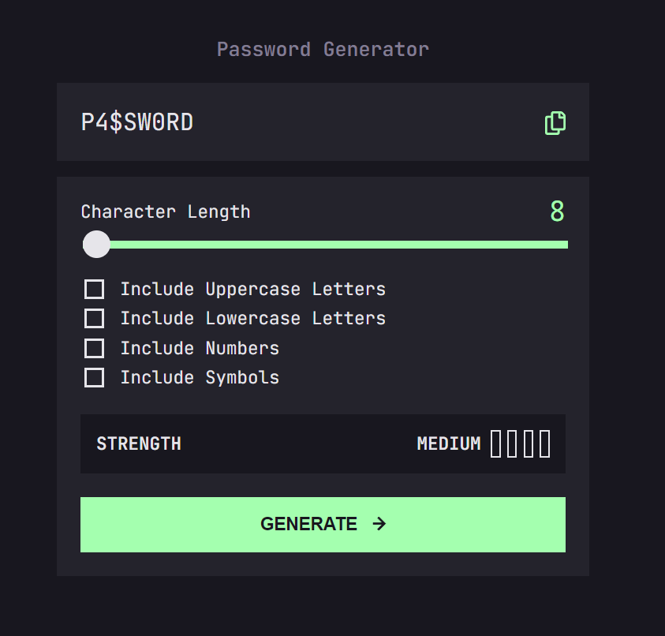

## Table of contents

- [Overview](#overview)
  - [Features](#features)
  - [Screenshot](#screenshot)
  - [Links](#links)
  - [Built with](#built-with)
- [Author](#author)
- [Acknowledgments](#acknowledgments)

## Overview

### Features

This password generator app is built with TypeScript and styled with Sass, resulting in a modern-looking and responsive interface. The app provides users with a simple way to generate passwords that meet their specific requirements. Users can specify the length of the password and select which character types they would like to include: lowercase letters, uppercase letters, numbers, and symbols.

The app's interface is designed to be user-friendly and intuitive, with clear instructions and visual cues guiding the user through the password generation process. The app also features a password strength meter that provides instant feedback on the strength of the generated password.

The app is responsive, ensuring that it looks great and functions smoothly on devices of all sizes, from desktop computers to mobile phones. The use of TypeScript ensures that the app is robust and reliable, while the use of Sass ensures that the app's styling is modular and maintainable. Overall, this password generator app is a great example of modern web development practices, and is sure to be a valuable tool for anyone looking to create strong and secure passwords.

### Screenshot

### Links

Live Website: [Vercel]("")

### Built with

- [Typescript]("https://www.typescriptlang.org/") : a superset of JavaScript that allows for static typing, making it easier to catch errors during development.
- [Sass]("https://sass-lang.com/") : a CSS preprocessor

## Author

Bozai Cosmin

## Acknowledgments

This is a solution to the [Password generator app challenge on Frontend Mentor](https://www.frontendmentor.io/challenges/password-generator-app-Mr8CLycqjh). Frontend Mentor challenges help you improve your coding skills by building realistic projects.
